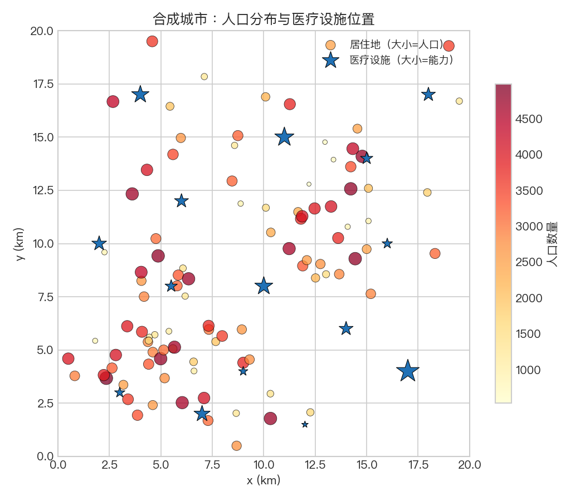
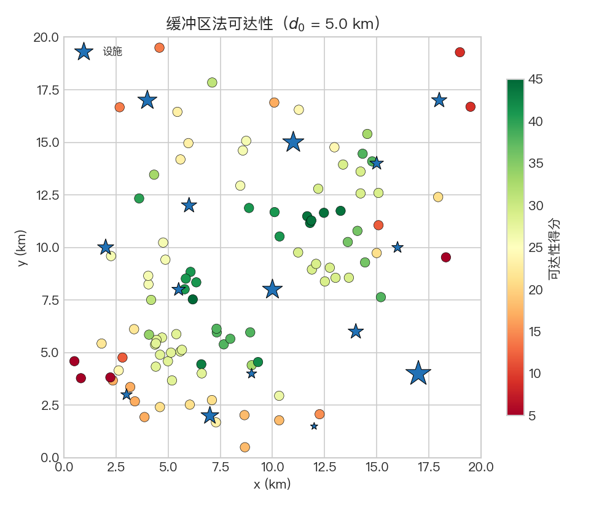
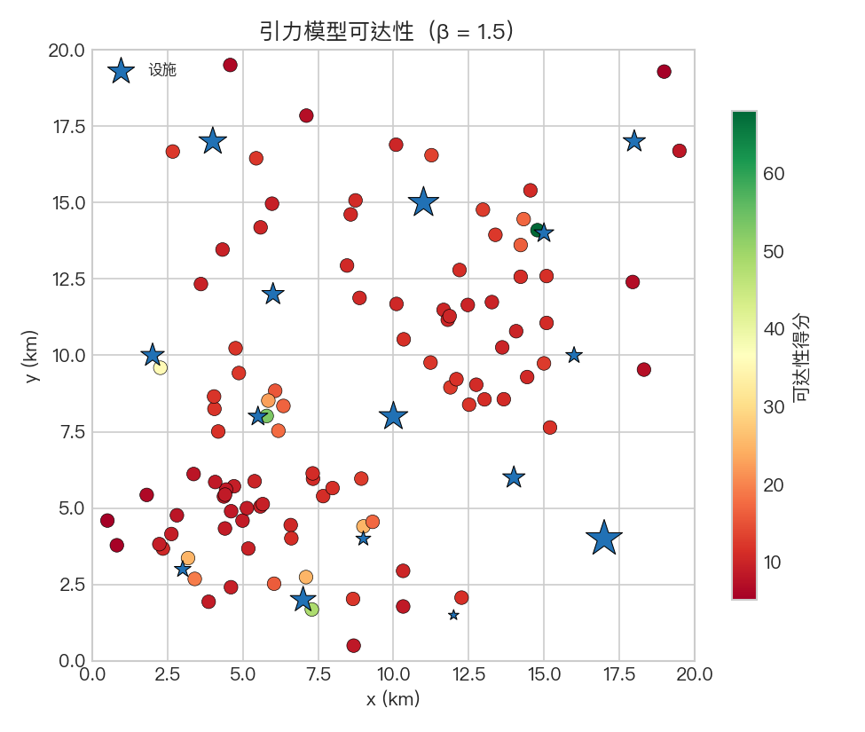
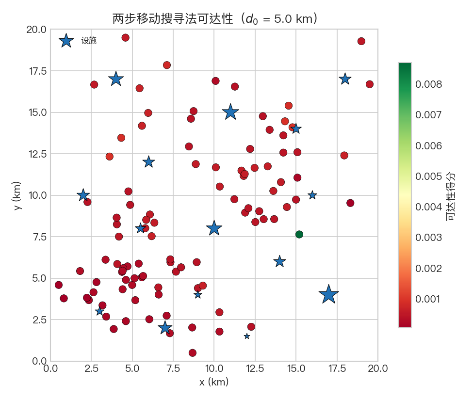
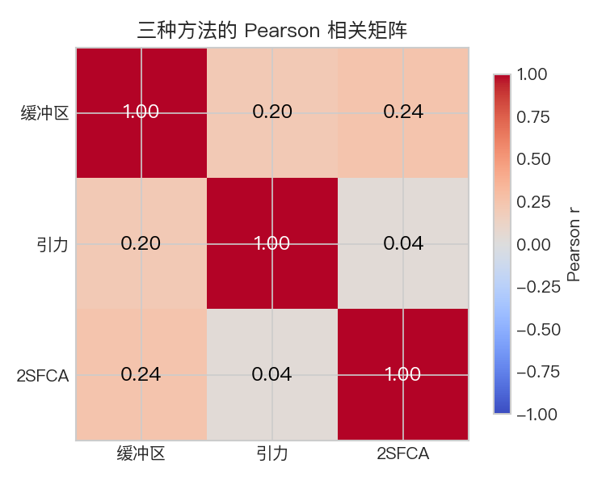

# 空间可达性：理论基础

本文从 **可达性的定义与框架 → 三类主流方法 → 方法比较与适用场景 → 与规划实践的连接** 构成一条完整的逻辑链，适合与 [`spatial_accessibility_analysis.ipynb`](spatial_accessibility_analysis.ipynb) 对照阅读：**理论文档负责概念、假设与推导；Notebook 按同一顺序给出数据、代码与图形**，二者节号大致对应。

> **公式渲染**：行内用 `$…$`，独立行用 `$$…$$`（GitHub 网页可正确显示）。若本地仅见源码，可在仓库网页端打开本文件。

---

### 图件与 Notebook 的对应（`outputs/spatial-accessibility/`）

下列图由 Notebook 生成并保存在 [`outputs/spatial-accessibility/`](../../outputs/spatial-accessibility/)。

| 图件 | 内容 | 建议结合的理论节 |
|------|------|------------------|
| `city_overview.png` | 合成城市：人口分布与设施位置 | [§2](#2-空间可达性的度量框架) |
| `buffer_accessibility.png` | 缓冲区法可达性空间分布 | [§3](#3-缓冲区法) |
| `gravity_accessibility.png` | 引力模型可达性空间分布 | [§4](#4-引力模型) |
| `sfca_accessibility.png` | 两步移动搜寻法可达性空间分布 | [§5](#5-两步移动搜寻法-2sfca) |
| `method_comparison.png` | 三种方法结果相关性矩阵 | [§6](#6-方法比较与适用场景) |
| `decay_functions.png` | 不同距离衰减函数形状 | [§4](#4-引力模型) |

---

## 1. 问题设定：为何要度量空间可达性

### 1.1 可达性的直觉含义

日常语言里，"这个地方到医院方便吗？"包含两层含义：

1. **距离**：设施离我有多远（直线、路网或时间）
2. **供给**：那里的设施质量/容量如何、是否拥挤

**空间可达性**（spatial accessibility）的研究正是为了把这两个维度 **系统量化**，回答"哪些人群、哪些地区在获得特定服务上处于劣势"。

### 1.2 为什么不能只用距离

- **最近距离**只关注最近一个设施，忽略了区域内所有设施的总体供给；
- **距离矩阵**忽略了需求侧（人口、患者数量）对供给的竞争消耗；
- 单纯的"范围内设施数量"未考虑设施规模差异。

不同方法对上述问题的处理方式不同，是本案例三种方法比较的核心。

### 1.3 典型应用场景

- **公共卫生**：医院、诊所、药店的服务可达性与不平等评估
- **教育规划**：学校布局优化
- **应急管理**：消防站、急救站的覆盖分析
- **城市治理**：公共设施选址、"15分钟生活圈"评估

---

## 2. 空间可达性的度量框架

### 2.1 基本要素

空间可达性度量通常包含三个基本要素：

| 要素 | 符号 | 说明 |
|------|------|------|
| 需求点（居住地） | $i$ | 人口分区的质心，带人口权重 $P_i$ |
| 供给点（设施） | $j$ | 设施位置，带服务能力 $S_j$（床位数、医生数等） |
| 阻抗（距离/时间） | $d_{ij}$ | 需求点 $i$ 到设施 $j$ 的距离或行程时间 |

### 2.2 可达性函数的一般形式

Hansen（1959）提出的**势模型**（potential model）是许多可达性度量的共同基础：

$$
A_i = \sum_j f(d_{ij}) \cdot S_j,
$$

其中 $f(\cdot)$ 为**距离衰减函数**（distance decay function），表示阻抗越大、设施对需求点的贡献越小。不同方法对 $f$ 和供需竞争的处理方式不同。

### 2.3 距离与阻抗的类型

- **欧氏距离**（直线）：最简单，可从坐标直接计算；忽略路网
- **路网距离**：更真实，需要道路网络数据（如 `osmnx`）
- **行程时间**：考虑道路等级、拥堵等因素，需交通数据
- 本案例使用**欧氏距离**，原理相同，可直接替换为路网距离

---

## 3. 缓冲区法

### 3.1 基本思想

设定一个**阈值距离**（catchment radius）$d_0$，统计需求点 $i$ 在该范围内的设施数量（或容量之和）：

$$
A_i^{\text{buffer}} = \sum_{j:\, d_{ij} \le d_0} S_j.
$$

### 3.2 特点与局限

**优点**：
- 计算简单直观，易于理解和解释
- 天然对应"步行/骑行/驾车可达圈"

**局限**：
- 阈值内 **全权重**，阈值外 **零权重**——边界处不连续
- 不考虑需求竞争：设施对同一服务区内所有居民等量贡献，忽略了人口压力
- 对 $d_0$ 的选择**高度敏感**

### 3.3 阈值选取建议

| 情景 | 典型阈值（欧氏距离估计） |
|------|--------------------------|
| 步行（约15分钟） | 1–1.5 km |
| 骑行（约15分钟） | 3–5 km |
| 驾车（约15分钟） | 5–10 km |
| 路网时间 30 分钟 | 依城市结构而定 |

---

## 4. 引力模型

### 4.1 公式

引力模型（gravity model）借鉴牛顿万有引力思想，用**连续的距离衰减函数**代替缓冲区的突变权重：

$$
A_i^{\text{gravity}} = \sum_j \frac{S_j}{f(d_{ij})},
$$

其中 $f(d_{ij})$ 常见形式有：

| 衰减函数 | 公式 | 参数含义 |
|----------|------|----------|
| 幂函数 | $f(d) = d^\beta$ | $\beta$ 为距离摩擦系数 |
| 指数函数 | $f(d) = e^{\lambda d}$ | $\lambda$ 控制衰减速率 |
| 高斯函数 | $f(d) = e^{(d/\sigma)^2}$ | $\sigma$ 为衰减尺度 |

### 4.2 幂函数衰减

最经典的形式为：

$$
A_i^{\text{gravity}} = \sum_j \frac{S_j}{d_{ij}^\beta}.
$$

- $\beta$ 越大，距离惩罚越重，结果越局域化
- $\beta = 0$ 退化为简单加总（不考虑距离）
- 典型取值：$\beta \in [1, 2]$，医疗设施研究中常见 $\beta = 1.5$

### 4.3 与缓冲区法的关系

引力模型可以视为缓冲区法的**连续化推广**：
- 缓冲区：$f(d) = \mathbf{1}[d \le d_0]$（0-1 权重）
- 引力模型：$f(d)$ 为连续递增函数，避免了边界突变

### 4.4 局限

引力模型仍然**未考虑供给的竞争消耗**：设施 $j$ 的容量 $S_j$ 对周围每个居民都"全量贡献"，未扣减已被其他需求点"使用"的部分。

---

## 5. 两步移动搜寻法（2SFCA）

两步移动搜寻法（Two-Step Floating Catchment Area，2SFCA）由 Radke & Mu（2000）提出、Luo & Wang（2003）完善，是目前**医疗可达性研究中使用最广泛**的方法之一，其核心改进是**同时考虑供给侧和需求侧**。

### 5.1 两步算法

**第一步**：从每个**设施** $j$ 出发，在其服务区（半径 $d_0$ 内）汇总人口需求，计算**供需比**（physician-to-population ratio）：

$$
R_j = \frac{S_j}{\displaystyle\sum_{k:\, d_{kj} \le d_0} P_k},
$$

其中 $P_k$ 为需求点 $k$ 的人口数量。$R_j$ 越大，表示该设施相对于服务的人口而言资源越充足。

**第二步**：从每个**需求点** $i$ 出发，在其可达圈（半径 $d_0$ 内）内汇总所有设施的供需比：

$$
A_i^{\text{2SFCA}} = \sum_{j:\, d_{ij} \le d_0} R_j.
$$

$A_i$ 越高，表示可达性越好。

### 5.2 直觉解释

- **第一步**：设施的"有效容量"被平摊到其服务区人口，人口越多则每人分到的资源越少（$R_j$ 越小）
- **第二步**：居民将其可达圈内所有设施的"有效容量"叠加，获得综合可达性

### 5.3 与引力模型的关系

2SFCA 可以理解为引力模型的**离散化 + 供需平衡**版本：

| 维度 | 引力模型 | 2SFCA |
|------|----------|-------|
| 距离衰减 | 连续函数 | 阈值内等权（或加权变体） |
| 供给竞争 | 不考虑 | 第一步显式计算供需比 |
| 解释性 | 相对模糊（综合势能） | 明确（供需比）|

### 5.4 增强型 2SFCA（E2SFCA）

Luo & Qi（2009）在第一步和第二步均引入**距离衰减权重**，替代原始的 0-1 阈值：

$$
R_j = \frac{S_j}{\displaystyle\sum_{k:\, d_{kj} \le d_0} W(d_{kj}) \cdot P_k}, \qquad
A_i^{\text{E2SFCA}} = \sum_{j:\, d_{ij} \le d_0} W(d_{ij}) \cdot R_j,
$$

其中 $W(d)$ 为距离衰减权重（如高斯函数）。本 Notebook 演示基础 2SFCA，E2SFCA 作为延伸练习保留。

---

## 6. 方法比较与适用场景

### 6.1 三种方法对照

| 方法 | 距离处理 | 供需竞争 | 计算复杂度 | 适用场景 |
|------|----------|----------|------------|----------|
| 缓冲区 | 阈值内等权 | 不考虑 | 低 | 快速评估、数据匮乏时 |
| 引力模型 | 连续衰减 | 不考虑 | 中 | 连续可达性面、区域比较 |
| 2SFCA | 阈值内等权（或加权） | 考虑 | 中 | 医疗、教育等公共服务评估 |

### 6.2 选择建议

- 仅关注**覆盖率**（有没有）：缓冲区法
- 关注**综合吸引力**（各方向设施的总体吸引力）：引力模型
- 关注**公平性**（考虑人口与设施容量的匹配）：2SFCA 或 E2SFCA
- 有完整路网数据：三种方法均可替换欧氏距离为路网时间

### 6.3 实践注意事项

1. **数据单位一致性**：距离单位（米/千米）与阈值参数须统一
2. **设施容量定义**：可用床位数、执业医师数、营业面积等，需根据研究问题选择
3. **需求代理变量**：区级人口总数、特定年龄段人口、患病人口等
4. **阈值敏感性**：建议对多个阈值做敏感性分析，观察结论稳定性

---

## 7. 与规划实践的连接

### 7.1 空间不平等评估

可达性差异可以用 **基尼系数（Gini coefficient）** 或 **变异系数（CV）** 量化：

$$
\text{CV} = \frac{\sigma(A)}{\mu(A)},
$$

值越大，表示不同地区之间的可达性差异越大。

### 7.2 设施选址优化

在给定新增设施数量 $K$ 的约束下，最大化最低可达性或最小化可达性不平等，是经典的 **覆盖选址问题**（coverage location problem）和 **p-中位数问题**（p-median problem）。

### 7.3 "15分钟生活圈"

中国城市规划实践中的"15分钟生活圈"本质上是缓冲区法的应用——要求居民在步行15分钟内能够到达基本公共服务设施。2SFCA 则可进一步评估这些设施的**质量与供需匹配**。

---

## 8. 本 Notebook 未展开的主题（延伸阅读）

- **增强型 2SFCA（E2SFCA）**：在两步中均引入距离衰减权重
- **路网可达性**：用 `osmnx` 获取真实路网，用行程时间替代直线距离
- **动态可达性**：考虑设施开放时间、交通时变特性
- **多目标可达性**：同时考虑多类设施（医院 + 诊所 + 药房）
- **贝叶斯可达性**：不确定性量化与可达性置信区间

系统书目见仓库根目录 [`README.md`](../../README.md)。

---

## 9. 符号与约定小结

- $i$：需求点（居住地）索引；$j$：供给点（设施）索引
- $P_i$：需求点 $i$ 的人口数量
- $S_j$：设施 $j$ 的服务能力（如医生数、床位数）
- $d_{ij}$：需求点 $i$ 到设施 $j$ 的距离（本案例为欧氏距离）
- $d_0$：搜寻半径（服务区阈值距离）
- $\beta$：引力模型的距离摩擦系数
- $R_j$：设施 $j$ 的供需比（2SFCA 第一步）
- $A_i$：需求点 $i$ 的可达性得分
