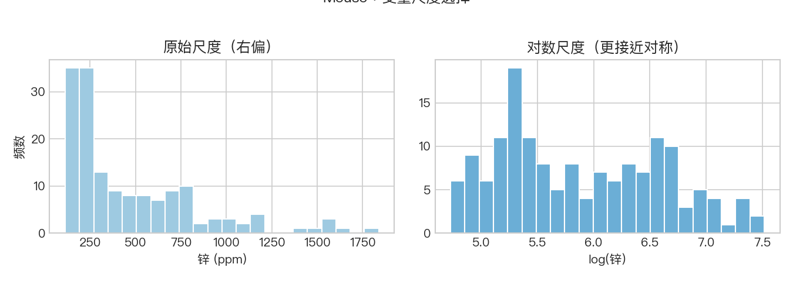
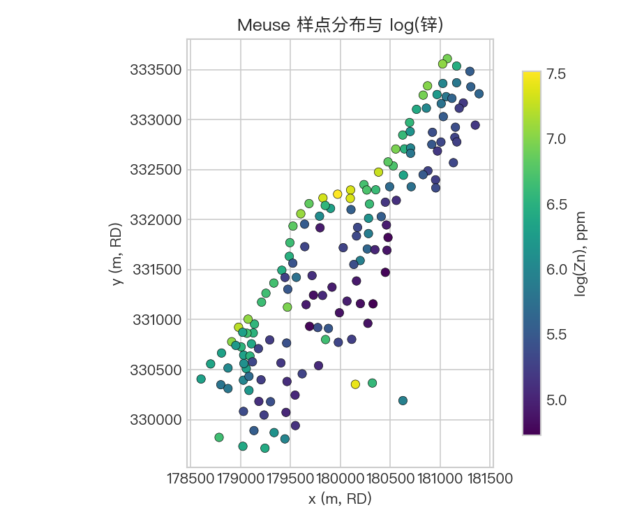
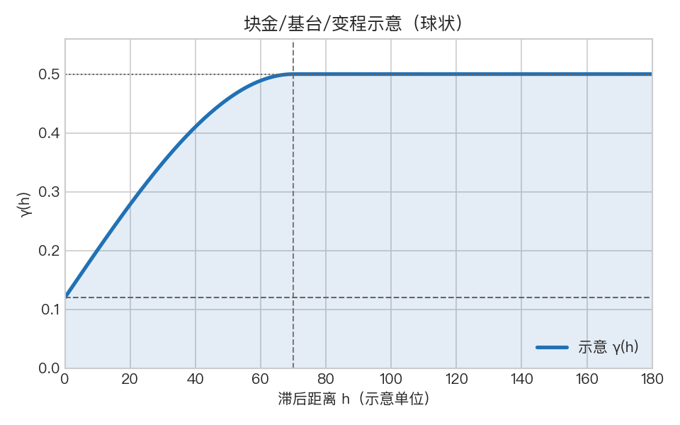
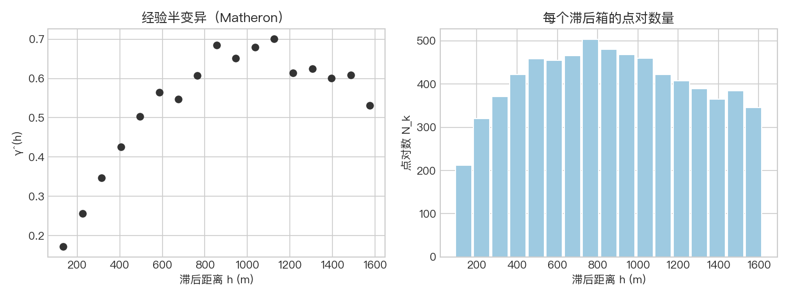
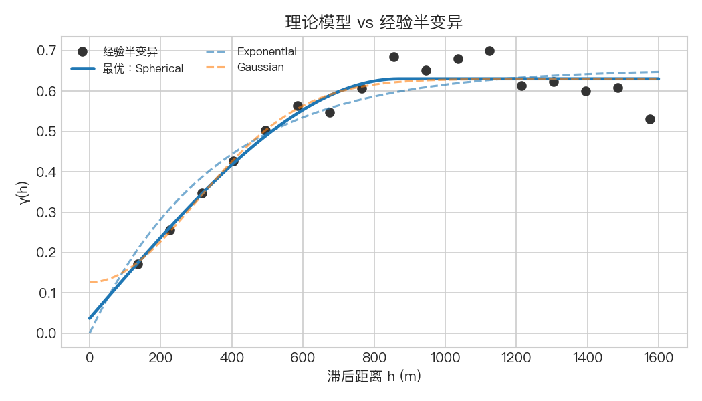

# 空间变异与半变异函数：理论基础

本文从 **概率模型 → 平稳性假设 → 协方差/变异函数 → 经验估计 → 参数化模型 → 克里金** 串起一条可自洽的逻辑链，篇幅长于「速览」，适合与可运行案例 [`spatial_variability_meuse.ipynb`](spatial_variability_meuse.ipynb) **对照阅读**：**理论文档负责定义、假设与推理；Notebook 按同一顺序给出数据、图形与代码**，二者节号大致对应。

> **公式渲染**：行内用 `$…$`，独立行用 `$$…$$`（GitHub 网页可正确显示）。若本地仅见源码，可在仓库网页端打开本文件。

---

### 图件与 Notebook 的对应（`outputs/`）

下列图由 Notebook 生成并保存在 [`outputs/`](../../outputs/)。阅读下文时，可随时回到 Notebook 运行对应单元，对照数值与分箱设置。

| 图件 | 内容 | 建议结合的理论节 |
|------|------|------------------|
| `meuse_zinc_log_hist.png` | 原始锌 vs `log(zinc)` 直方图（变换动机） | [§2](#2-区域化变量与随机函数) |
| `meuse_logzn_points.png` | 样点与 `log(zinc)` 分布 | [§2–§3](#2-区域化变量与随机函数) |
| `semivariogram_concept.png` | 球状型 $\gamma(h)$ 上块金/基台/变程示意（**教学数值**，非本数据拟合） | [§4](#4-协方差函数与变异函数)、[§7](#7-块金基台与变程读图与尺度换算) |
| `empirical_variogram.png` | 经验半变异 $\hat\gamma(h)$ | [§5](#5-经验半变异与-matheron-估计) |
| `fitted_variogram_models.png` | 球状/指数/高斯与经验曲线对比 | [§6](#6-常见各向同性变异函数模型) |

---

## 1. 问题设定：为何需要「空间变异」

### 1.1 独立同分布假设在这里失效

经典统计里，若样本 $Z_1,\ldots,Z_n$ **独立同分布**，则联合分布是各边缘分布的乘积，**样本顺序或空间位置不起作用**。但地理上的观测 $Z(\mathbf{x}_1),\ldots,Z(\mathbf{x}_n)$ 通常 **既不独立，也未必同分布**：相距很近的两点往往因共享相似的成土环境、污染源或水文过程而 **取值相近**。若仍按 i.i.d. 处理，会 **低估有效信息量**（相当于假装不知道哪些观测彼此冗余），也会 **错误评估插值或预测的不确定性**。

### 1.2 空间变异分析要回答什么

**空间变异分析**（在此狭义指二阶或内蕴结构下的 **变异函数/协方差建模**）试图回答：

1. **相似性随距离如何衰减**：滞后 $\mathbf{h}$ 增大时，$Z(\mathbf{x})$ 与 $Z(\mathbf{x}+\mathbf{h})$ 还能多像？
2. **能否用少量参数概括这种衰减**，以便在克里金等线性预测器里构造协方差矩阵？
3. **衰减中的「不连续」「饱和距离」「平滑程度」** 各有什么物理或统计含义？

下文用随机函数语言把这些问题形式化。

---

## 2. 区域化变量与随机函数

### 2.1 定义

设研究区域 $D\subset\mathbb{R}^d$（常见 $d=2$ 或 $3$）。**区域化变量**指定义在 $D$ 上、随位置变化的数量场，记为 $\{Z(\mathbf{x}):\mathbf{x}\in D\}$。地统计的标准做法是把 $Z(\cdot)$ 看成某个 **随机函数**（random function）$\{Z(\mathbf{x})\}$ 的一次 **实现**（realization）：我们手头只有一条已「掷出」的空间轨迹，而非在固定 $\mathbf{x}$ 上重复抽样。

### 2.2 与多元随机向量的关系

在 $n$ 个样点 $\mathbf{x}_1,\ldots,\mathbf{x}_n$ 上，$(Z(\mathbf{x}_1),\ldots,Z(\mathbf{x}_n))$ 就是一个 **$n$ 维随机向量**。空间分析的特殊之处在于：我们事先知道各分量对应的 **坐标**，从而可以讨论 **随空间分离距离变化的联合结构**（例如协方差只依赖 $\mathbf{x}_i-\mathbf{x}_j$），而不仅是边缘分布。

### 2.3 本案例中的实现

Notebook 中的 Meuse 土壤锌浓度，可视为某 $Z(\mathbf{x})$ 在离散点集上的一次观测。对锌取对数是为使分布更接近对称、**使基于二阶矩的描述更稳定**（见 §10 符号说明）。严格来说变换后应记为新过程 $Y(\mathbf{x})=\log Z(\mathbf{x})$；下文为简洁仍用 $Z$ 泛指所分析的区域化变量。

---

## 3. 平稳性：从「能估计什么」出发

### 3.1 为何需要平稳性

要从 **单个实现** 的一条空间轨迹估计总体矩（协方差、变异函数），若允许均值与协方差随 $\mathbf{x}$ 任意变化，则许多参数 **不可识别**。平稳性是一族 **结构约束**：把「随位置变化」的自由度换成「随滞后 $\mathbf{h}$ 变化」，从而 **用不同空间位置的点对去平均**，近似期望运算。

### 3.2 二阶平稳

**二阶平稳**（second-order stationarity）要求存在常数均值 $m$ 与协方差函数 $C(\mathbf{h})$，使得对一切 $\mathbf{x},\mathbf{x}+\mathbf{h}\in D$：

$$
\mathbb{E}[Z(\mathbf{x})]=m,\qquad
\mathrm{Cov}\bigl(Z(\mathbf{x}),Z(\mathbf{x}+\mathbf{h})\bigr)=C(\mathbf{h}).
$$

于是方差有限：$\mathrm{Var}(Z(\mathbf{x}))=C(\mathbf{0})$。协方差只依赖 **滞后向量** $\mathbf{h}$，与绝对位置 $\mathbf{x}$ 无关。

### 3.3 内蕴假设

**内蕴假设**（intrinsic hypothesis）更弱：不要求 $Z(\mathbf{x})$ 有方差，但要求 **增量** $Z(\mathbf{x}+\mathbf{h})-Z(\mathbf{x})$ 零均值且其方差只依赖 $\mathbf{h}$：

$$
\mathbb{E}\bigl[Z(\mathbf{x}+\mathbf{h})-Z(\mathbf{x})\bigr]=0,\qquad
\mathrm{Var}\bigl(Z(\mathbf{x}+\mathbf{h})-Z(\mathbf{x})\bigr)=2\gamma(\mathbf{h}),
$$

其中 $\gamma(\mathbf{h})$ 为（半）变异函数（见 §4）。许多具有长程相关的过程二阶平稳不成立，但内蕴仍可能成立，此时用 $\gamma$ 描述更合适。

### 3.4 与「趋势」的关系

若存在明显 **漂移**（如 $Z$ 随某一坐标系统增大），则 $\mathbb{E}[Z(\mathbf{x})]$ 非常数，二阶平稳 **直接不成立**。常见处理：**去趋势**（回归残差作为新的区域化变量）、**泛克里金**（把均值建模为坐标的函数）、或 **限定在局部平稳子区域** 内估计。Notebook 中的样点分布图，正是为了在估计 $\gamma$ 之前 **肉眼检查** 是否存在强烈趋势或分区。

---

## 4. 协方差函数与变异函数

### 4.1 协方差函数

在二阶平稳下，定义

$$
C(\mathbf{h})=\mathbb{E}\bigl[(Z(\mathbf{x})-m)(Z(\mathbf{x}+\mathbf{h})-m)\bigr].
$$

$C(\mathbf{0})$ 为过程方差；$C(\mathbf{h})$ 随 $h=\lVert\mathbf{h}\rVert$ 增大通常 **减小**，表示远距离点去相关。

### 4.2 （半）变异函数

定义

$$
\gamma(\mathbf{h})=\tfrac{1}{2}\,\mathbb{E}\Bigl[\bigl(Z(\mathbf{x}+\mathbf{h})-Z(\mathbf{x})\bigr)^2\Bigr].
$$

在内蕴假设下，上式与 $\mathbf{x}$ 无关。**系数 $\tfrac12$** 使 $\gamma$ 与增量方差的关系为 $\mathrm{Var}(\Delta Z)=2\gamma(\mathbf{h})$。文献中有的用 **变异函数** $2\gamma$，读图与读表时务必核对定义。

### 4.3 二阶平稳且方差有限时的经典关系

若二阶平稳成立且方差有限，则

$$
\gamma(\mathbf{h})=C(\mathbf{0})-C(\mathbf{h}).
$$

**直观**：$h$ 小时 $C(\mathbf{h})$ 接近 $C(\mathbf{0})$，故 $\gamma$ 接近 $0$；$h$ 大时 $C(\mathbf{h})$ 变小，$\gamma$ 增大并趋于 **基台**（若存在）。协方差视角强调「还有多少共同波动」；变异函数视角强调「两点差有多大」——二者信息等价，克里金实现中常互换使用。

### 4.4 各向同性

若 $\gamma(\mathbf{h})$ 只依赖 $h=\lVert\mathbf{h}\rVert$，则称 **各向同性**。Notebook 在欧氏距离下分箱估计 $\hat\gamma(h)$，即默认各向同性；若真实过程沿河流方向相关更强，则应使用 **几何各向异性** 等更丰富的模型（§9）。

---

## 5. 经验半变异与 Matheron 估计

### 5.1 离散数据下的基本想法

真实 $\gamma(h)$ 未知。对样点 $\{\mathbf{x}_i,Z_i\}_{i=1}^n$，在 **各向同性** 下，将点对 $(i,j)$ 按距离 $h_{ij}=\lVert\mathbf{x}_i-\mathbf{x}_j\rVert$ 分入区间 $(b_{k-1},b_k]$，记第 $k$ 箱的中心为 $h_k$（或代表值），箱内集合为 $\mathcal{B}_k$，点对数为 $N_k$。**Matheron 估计量**为

$$
\hat\gamma(h_k)=\frac{1}{2N_k}\sum_{(i,j)\in\mathcal{B}_k}(Z_i-Z_j)^2.
$$

这是对同一箱内所有点对的 **样本半方差平均**，用作 $\gamma(h_k)$ 的矩估计。

### 5.2 分箱宽度与最大滞后

- **箱宽过大**：平滑掉真实结构，曲线变粗。
- **箱宽过小**：每箱内点对少，$\hat\gamma$ **方差大**、抖动明显。
- **最大滞后过大**：远距离点对稀少且易受 **边界效应**、大尺度趋势污染。

因此 $\hat\gamma$ 既是 **估计** 也是 **探索性图形**；Notebook 中打印各箱 **counts** 正是为了检查是否有空箱或极不可靠的箱。

### 5.3 与「遍历性」的脚注

严格来说，用空间平均代替系综期望，隐含 **遍历性** 或至少 **可混合性** 类假设；实务中常结合领域知识与模型检验（交叉验证等）判断经验曲线是否可用。本仓库不展开证明，读者可参阅 Cressie、Chilès & Delfiner 等专著。

---

## 6. 常见各向同性变异函数模型

经验点 $\hat\gamma(h_k)$ 需用 **条件正定** 的参数模型 $\gamma(h;\theta)$ 光滑化并外推（克里金需要合法的协方差模型）。常见 **有界** 与 **无界** 两类轮廓（以下用 $C_0$ 表示块金、$C_1$ 表示部分基台、$a$ 表示相关尺度参数；具体参数化因软件而异）。

### 6.1 球状（spherical）

在 $0<h\le a$ 内上升至 $C_0+C_1$，$h\ge a$ 保持平坦，是最经典的 **有有限变程** 模型之一。曲线在 $h=a$ 处 **一阶导数不连续**（仍合法）。

### 6.2 指数（exponential）

$\gamma(h)$ **渐近** 趋于基台，**无有限变程**；工程上常取 **实用变程** $3a$ 表示「约 95% 相关已消失」的距离（与指数协方差 $e^{-h/a}$ 的衰减尺度一致，具体常数依定义略有出入）。

### 6.3 高斯（Gaussian）

在原点附近 **极其光滑**（可微性高），适合非常平滑的场；对拟合与异常值 **更敏感**，滥用可能导致克里金系统病态。

### 6.4 为何需要块金项

纯结构项常在 $h\to 0^+$ 时趋于 $0$，但经验曲线常在近原点处 **有跳跃**。在模型中加入 **块金 $C_0$** 相当于在协方差中叠加一个 **白噪声** 或在原点处的 **不连续**，用以吸收测量误差、微尺度变异及小于采样间距的结构。

---

## 7. 块金、基台与变程：读图与尺度换算

### 7.1 三个术语在曲线上的位置

对有界型（或实用意义上已「贴到基台」）的曲线：

| 术语 | 在 $\gamma(h)$ 上读什么 |
|------|-------------------------|
| **块金（nugget）** $C_0$ | $h\to 0^+$ 时曲线相对原点的 **跃迁**；并非「地球化学意义上的块」而是历史译名。 |
| **基台（sill）** | 曲线进入 **平台** 后的水平；总基台常写为 $C_0+C_1$，其中 $C_1$ 为 **部分基台**（结构项贡献）。 |
| **变程（range）** | 与模型定义绑定：球状模型在距离 $a$ 处到达基台；指数/高斯则常用 **实用变程** 与参数 $a$ 换算（见 §6.2）。 |

### 7.2 与克里金权重的直觉

变程大表示 **远距离样点仍相关**，插值权重分散；变程小则权重更 **局域**。块金大表示 **近点数据也噪声大**，插值更平滑、对单点异常不敏感。定量关系由克里金方程给出（§8）。

### 7.3 与软件参数的对应

`gstools` 等库用 `nugget`、`var`（部分基台）、`len_scale` 等内部参数；**务必阅读文档** 确认 `len_scale` 与经典文献中 $a$ 的换算。Notebook 在打印 **有效相关距离** 时，对球状/指数/高斯给出常用工程换算，仅作 **解读辅助**。

---

## 8. 与克里金的关系

克里金（简单克里金、泛克里金、协同克里金等）在 **已知协方差或变异函数** 的前提下，构造 **线性、无偏**（在相应约束下）的预测器，并在高斯假设下给出预测方差。其权重由 **协方差矩阵** 与点与预测点之间的协方差向量决定；该矩阵必须由 **条件正定** 的模型生成。

因此：**变异函数估计偏了 → 协方差结构偏了 → 插值与方差都偏**。实务上常把 **稳健的变异函数建模** 视作空间预测流水线中的第一步；进一步的交叉验证、贝叶斯地统计等则是在此之上的质量与不确定性控制。

---

## 9. 本仓库 Notebook 未展开的主题（延伸阅读）

- **各向异性**：相关距离随方向变化；可用线性变换 $h\to\sqrt{h^\top Q h}$ 或方向变异图。
- **稳健变异函数**：抑制异常值对 $\hat\gamma$ 的拉动。
- **交叉验证**：比较不同模型与参数化对预测误差的刻画。
- **非平稳与泛克里金**：空间漂移的均值建模。

系统书目见仓库根目录 [`README.md`](../../README.md)。

---

## 10. 符号与约定小结

- $\mathbf{x}$：空间位置；$\mathbf{h}$：滞后向量；$h=\lVert\mathbf{h}\rVert$：各向同性距离。
- $\gamma(h)$：本文默认 **半变异**；部分文献的 variogram 指 $2\gamma(h)$。
- $\hat\gamma(h_k)$：第 $k$ 滞后箱上的 **经验半变异**（Matheron）。
- $C_0$、$C_1$：块金与部分基台；$C_0+C_1$：总基台（对纯块金+单结构项情形）。
- 对偏态化学含量常用 **对数变换** 再估计 $\gamma$；解释预测结果时需 **反变换** 或报告对数尺度上的不确定性。
