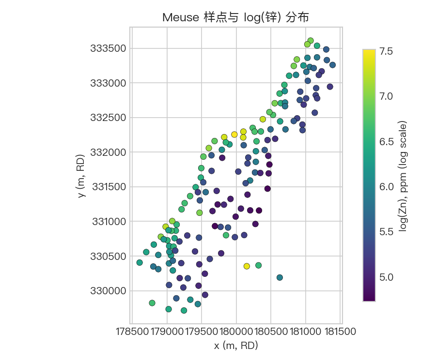
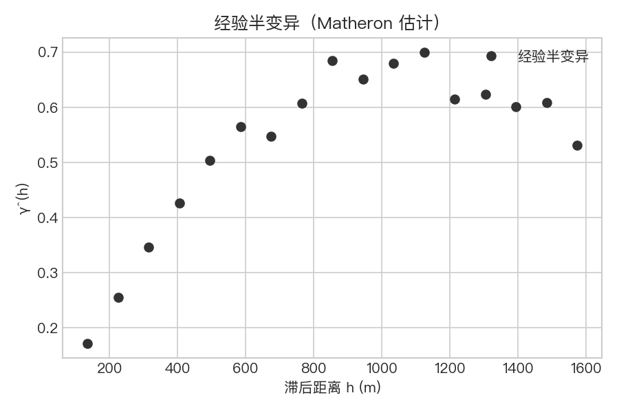
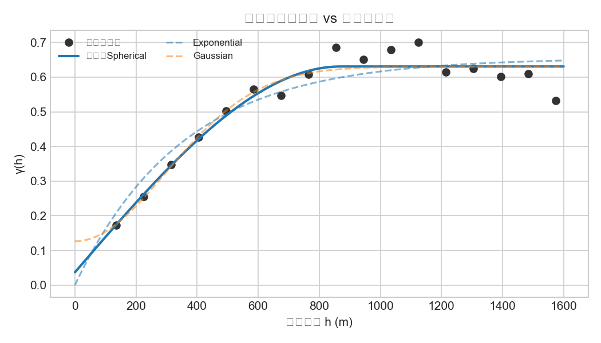

全文与可运行代码见 GitHub 仓库 [Spatial_Analysis](https://github.com/Mocha0724/Spatial_Analysis)，主 Notebook 路径：`cases/spatial-variability/spatial_variability_meuse.ipynb`。

## 问题与目标

在给定点状土壤样点上，刻画某重金属（本例为 **锌**）的 **空间变异结构**：随距离变化的 **半变异函数**，并估计 **块金**、**基台** 与 **变程尺度**，作为克里金插值或不确定性分析中协方差模型的常见前置步骤。

## 数据与变量

采用荷兰 Meuse 河漫滩经典教学数据（R `sp::meuse` 体系）。区域化变量取 **`log(zinc)`**（ppm 的对数），与常见 `gstat` 教程一致。坐标为荷兰 RD（EPSG:28992）平面米制坐标。

数据说明与获取方式见仓库 [`data/README.md`](../data/README.md)，下载脚本见 [`scripts/download_meuse.py`](../scripts/download_meuse.py)。

## 方法要点

1. **经验半变异**：对选定滞后分箱，用 Matheron 估计量得到 γ̂(h)。
2. **理论模型**：在球状、指数、高斯等候选模型中拟合块金、偏基台与相关长度，并在 γ 域比较拟合效果（本例以 RMS 为判据之一）。
3. **解释**：报告总基台（块金 + 部分基台）及与模型对应的 **有效相关距离** 常用换算。

## 结果图件

下列图像与仓库 [`outputs/`](../outputs/) 目录中的 PNG 一致。







若发布在独立博客，可将上述图片复制到站点静态资源目录后，按站点规则调整引用路径。

## 本地复现

```bash
git clone git@github.com:Mocha0724/Spatial_Analysis.git
cd Spatial_Analysis
python3 -m venv .venv && source .venv/bin/activate
pip install -r requirements.txt
python scripts/download_meuse.py
jupyter notebook cases/spatial-variability/spatial_variability_meuse.ipynb
```

Windows 下请将 `source .venv/bin/activate` 换为 `.venv\Scripts\activate`。

## 参考文献（GB/T 7714 示例）

[1] MATHERON G. Principles of geostatistics[J]. *Economic Geology*, 1963, 58(8): 1246-1266.

[2] CRESSIE N. *Statistics for Spatial Data: Revised Edition*[M]. New York: Wiley, 1993.

[3] WEBSTER R, OLIVER M A. *Geostatistics for Environmental Scientists (2nd ed.)*[M]. Chichester: Wiley, 2007.

[4] ISAAKS E H, SRIVASTAVA R M. *An Introduction to Applied Geostatistics*[M]. New York: Oxford University Press, 1989.

[5] CHILÈS J P, DELFINER P. *Geostatistics: Modeling Spatial Uncertainty (2nd ed.)*[M]. Hoboken: Wiley, 2012.

中文文献可按 GB/T 7714 或 APA 等惯例另行列出常用教材或译著。
